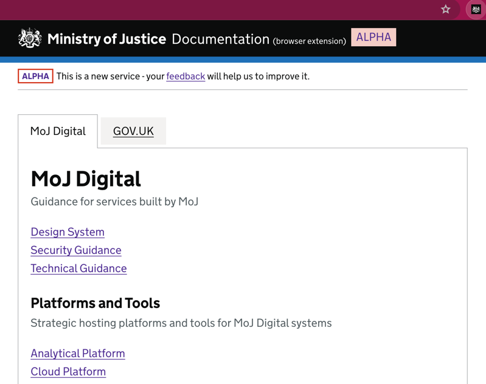

# ⚡️MoJ Documentation Browser Extension ⚡️

> **ℹ️ INFO** - This project has been built as part of a Firebreak Sprint and the future of this project is currently unclear.

## 🧑‍💻 Installing Locally with Chrome

To install this extension locally on your Chrome browser, follow these simple steps:

- 💾 **Clone** the repository
- 🔌 Open Chrome and go to **[chrome://extensions/](chrome://extensions/)**
- 👾 Enable **Developer Mode** by toggling the switch in the top right corner
- 📦 Click on **Load Unpacked** and select the **[./src/](./src/)** directory inside this repository
- 🥳 Voila! The extension is now installed locally on your Chrome browser
- 👀 You should now see the MoJ icon when you click jigsaw dropdown near the top right of your browser
- 📌 Make sure to pin the icon for easy access!

After installing, you should be able to to click the MoJ and see something similar to the below image 👀👇



## 📁 Folder Structure

```
.
├── LICENSE
├── README.md
└── src # 👈 root of the browser extension
    ├── assets # 👈 root of all static assets and pre-compiled librararies
    ├── manifest.json # 👈 plugin metadata and entry point for all plugin features 
    └── popup # 👈 files related to the browser popup window when icon is pressed
```

## 📚 Resource For Building Browser Extensions

Some resources to help build browser extensions

- 🦊 [Mozilla Browser Extension Docs](https://developer.mozilla.org/en-US/docs/Mozilla/Add-ons/WebExtensions) - root page for Mozilla's in-depth documentation of browser extensions  
- ❓ [What are WebExtensions?](https://developer.mozilla.org/en-US/docs/Mozilla/Add-ons/WebExtensions/What_are_WebExtensions) - nice introduction to the basic concepts of web extensions
- 📝 [manifest.json](https://developer.mozilla.org/en-US/docs/Mozilla/Add-ons/WebExtensions/manifest.json) - useful reference when working with the [manifest.json](./src/manifest.json)
